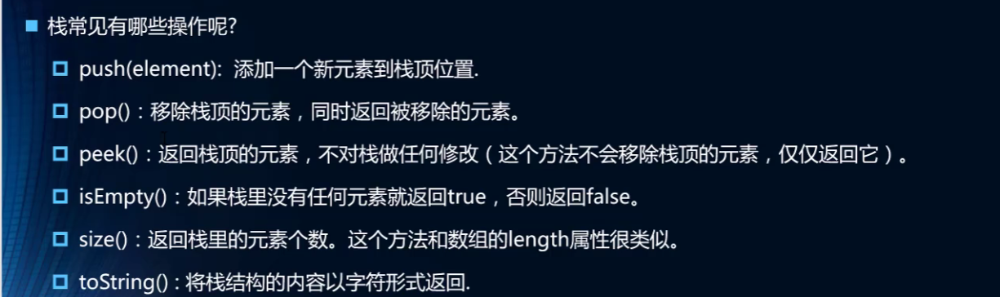
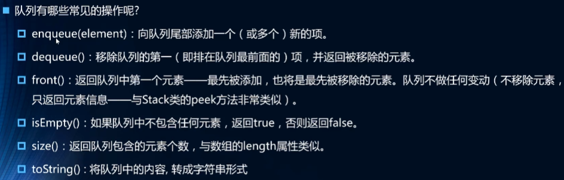

# 数据结构

- 常见的数据结构
  - 数组
  - 栈
  - 链表
  - 图
  - 散列表
  - 队列
  - 树
  - 堆

### 数组

JS数据是对封装的API调用

**普通语言的数组封装**

	- 常见语言的数组不能存放不同的数据类型,因此所有在封装时通常存放在数组中的是Object类型
	- 常见语言的数组容量不会自动改变(需要进行扩容操作)
	- 常见语言的数组进行中间插入和删除操作性能比较低

**数组优点**

​	根据下标修改元素非常快速

### 栈(受限的线性结构)

​		**先进后出**  (后进先出)

程序中运用到的栈  **函数调用栈**

​	A 调用B  B调用C C调用D

​	则执行过程中先A压入栈，然后B，C ， D

​	D执行完 弹出栈 C B A依次弹出

#### 栈结构的实现

- 基于数组实现

  - 栈的常见操作

    
    
  - ```javascript
    class Stack{
        constructor() {
            // 栈的属性
            this.items = []
        }
        // 栈的相关操作
        // 1.将元素压入栈
        push(e) {
            this.items.push(e)
        }
        // 2.从栈中取出元素
        pop() {
            return this.items.pop()
        }
        // 3.查看栈顶元素
        peek() {
            return this.items[this.items.length - 1]
        }
        // 4.判断栈是否为空
        isEmpty() {
            return this.items.length === 0
        }
        // 5.获取栈中元素的个数
        size() {
            return this.items.length
        }
        // 6.toString方法
        toString() {
            return this.items.join(' ')
        }
    }
    ```

  - 

- 基于链表实现

### 队列

 	**先进先出**

- 基于数组的实现

  - 队列常见操作

    
    
  - 实现代码

    ```javascript
        //  基于数组封装队列
        class Queue{
          //  属性
          constructor() {
            // 栈的属性
            this.items = []
          }
          //  方法
          //  将元素加入到队列中
          enqueue(e) {
            this.items.push(e)
          }
          // 从队列删除元素（删除第一个元素） (数组性能不高 删除第一后 后面会前移操作)
          dequeue() {
            return this.items.shift()
          }
          //  查看第一个元素
          front() {
            return this.items[0]
          }
          //  查看队列是否为空
          isEmpty() {
            return this.items.length === 0
          }
          // 查看队列中元素的个数
          size() {
            return this.items.length
          }
          //  toString方法
          toString() {
            return this.items.join(' ')
          }
        }
    ```

    

- 基于链表的实现


#### 优先级队列

​	**会根据优先级进行插队**

- 基于数组队列实现

  ```js
      class PriorityQueue {
        constructor() {
          this.items = []
        }
        _QueueItem(element, priority) {
          return {
            element,
            priority
          }
        }
        enqueue(element, priority) {
          let queueItem = this._QueueItem(element, priority)
          // 判断队列状态进行添加
          if(this.items.length === 0) {
            this.items.push(queueItem)
          } else {
            let add = false
            for(let i = 0; i < this.items.length;i++) {
              if(queueItem.priority < this.items[i].priority) {
                this.items.splice(i, 0, queueItem)
                add = true
                break
              }
            }
            if(!add) {
              this.items.push(queueItem)
            }
          }
        }
        // 从队列删除元素（删除第一个元素） (数组性能不高 删除第一后 后面会前移操作)
        dequeue() {
          return this.items.shift()
        }
        //  查看第一个元素
        front() {
          return this.items[0]
        }
        //  查看队列是否为空
        isEmpty() {
          return this.items.length === 0
        }
        // 查看队列中元素的个数
        size() {
          return this.items.length
        }
        //  toString方法
        toString() {
          let result = ''
          for (let i = 0; i < this.items.length; i++) {
            result += this.items[i].element + ' '
          }
          return result
        }
      }
  ```

  

- 基于链表实现

### 链表

- 链表的优点
  - 内存空间不是必须连续的，可以充分利用计算机的内存实现灵活的内存动态管理
  - 链表不必在创建时就确定大小，并且大小可以无限的延伸下去
  - 链表在插入和删除数据时，时间复杂度可以达到O(1)，相对数组效率高很多
- 缺点
  - 链表访问任何一个位置的元素时，都需要从头开始访问，(无法跳过第一个元素访问任何一个元素)
  - 无法通过下标直接访问元素,需要从头一个个访问，直到找到对应的元素

### 哈希表

哈希表通常是基于数组进行实现的,但是相对于数组,它也很多的优势:

- 它可以提供非常快速的插入-删除-查找操作
- 无论多少数据，插入和删除值需要接近常量的时间:即O(1)的时间级.实际上，只需要几个机器指令即可完成
- 哈希表的速度比树还要快,基本可以瞬间查找到想要的元素
- 哈希表相对于树来说编码要容易很多.

哈希表相对于数组的一些不足:

- 哈希表中的数据是没有顺序的,所以不能以一种固定的方式(比如从小到大)来遍历其中的元素

- 通常情况下,哈希表中的key是不允许重复的,不能放置相同的key,用于保存不同的元素.

哈希化冲突解决办法

- 链地址法

  - 分配的子空间为数组或链表

    新插入的数据频率高 前插入的化的用链表效率高，后插入数据链表数组都可以

- 开放地址法

  - 寻找新的空白位置放置冲突的数据香项
  - 探索位置的方式不用有三种方法
    - 线性探测
    - 二次探测
    - 再哈希法

### 树

空间率利用高，有序(效率一般情况下没有哈希表高)

相关术语

- 树（tree）：n（n ≥ 0）个节点构成的有限集合
  - n=0时，成为 **空树**
- 树中有个称为“根”的特殊节点，用r表示
- 其余节点可分为m（m>0)个互不相交的有限集T1，T2，..., Tm,其中每个集合本身又是一棵树，称为原来的树的**子树**
- 节点的度（Degree):    节点的子树个数
- 树的度: 树的所有节点中的最大的度数
- 叶节点：度为0的节点，也称为叶子节点
- 父节点： 有子树的节点是其子树的根节点的父节点
- 子节点： 若A节点是B节点的父节点，则称B是A节点的子节点，子节点叶称孩子节点
- 兄弟节点：具有同一个父节点的各个节点彼此是兄弟节点
- 路径和路径长度：从节点n1到nk的路径为一个节点序列n1,n1,..nk，ni是ni+1的父节点。路径所包含边的个数为路径的长度
- 节点的层次: 规定根节点在1层，其他任意节点的层数是其父节点的层数加1
- 树的深度：树中所有的节点中的最大层次是这棵树的深度

# 算法（Algorithm）

